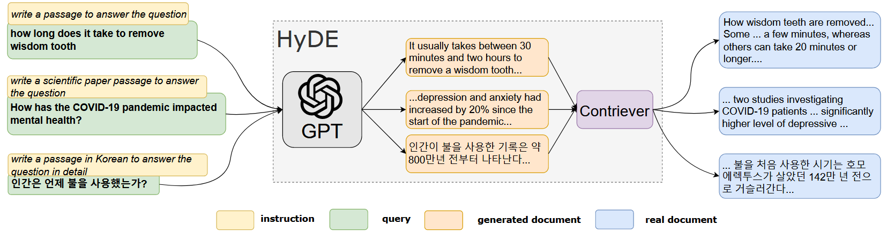

# HyDE
This is the reproduction of the paper:
- [Precise Zero-Shot Dense Retrieval without Relevance Labels](https://aclanthology.org/2023.acl-long.99/)

## Introduction
HyDE is a method that generates a hypothetical document using an instruction-following language model (e.g., InstructGPT) to capture relevance patterns. The generated document is then encoded into an embedding vector using an unsupervised contrastively learned encoder (e.g., Contriever). This vector identifies a neighborhood in the corpus embedding space, from which similar real documents are retrieved based on vector similarity. This second step grounds the generated document to the actual corpus, with the encoder's dense bottleneck filtering out the hallucinations.

<center>

</center>

## Running the Method
Before conducting the experiment, you need to prepare the generator. In this example, we use VLLM to deploy the generator, you can skip this step if you wish to use the generator from OpenAI.
```bash
bash ./run_generator.sh
```
This script will start a `Qwen2-7B-Instruct` model server on port 8000. You can change the `MODEL_NAME` in the script if you want to use a different model.

You also need to prepare the retriever. In this example, we use `FlexRAG/wiki2021_atlas_contriever` retriever.
```bash
git lfs install
git clone https://huggingface.co/FlexRAG/wiki2021_atlas_contriever
```
This will download the retriever to your local machine. 

Then, run the following command to evaluate the HyDE on the test set of `Natural Questions`:
```bash
bash ./run.sh
```
This script will run the HyDE method on the test set of `Natural Questions` and save the results in the `results` directory. You can change the `DATASET_NAME` and the `SPLIT` variables in the script to evaluate on different datasets.

## Experiments

### Experiment Settings
- **Model**: We use the `Qwen2-7B-Instruct` model.
- **Retriever**: We use `FlexRAG/wiki2021_atlas_contriever` retriever.
- **max_iterations**: We set the maximum number of iterations to 2.
- **top_k**: We set the number of top-k retrieved documents to 5.
- **temperature**: We set the generation temperature to 0 for deterministic generation.

### Experimental Results
TODO


## Citation
If you use this code in your research, please cite the following paper:

```bibtex
@software{Zhang_FlexRAG_2025,
author = {Zhang, Zhuocheng and Feng, Yang and Zhang, Min},
doi = {10.5281/zenodo.14593327},
month = jan,
title = {{FlexRAG}},
url = {https://github.com/ictnlp/FlexRAG},
year = {2025}
}
```

```bibtex
@inproceedings{gao-etal-2023-precise,
    title = "Precise Zero-Shot Dense Retrieval without Relevance Labels",
    author = "Gao, Luyu  and
      Ma, Xueguang  and
      Lin, Jimmy  and
      Callan, Jamie",
    editor = "Rogers, Anna  and
      Boyd-Graber, Jordan  and
      Okazaki, Naoaki",
    booktitle = "Proceedings of the 61st Annual Meeting of the Association for Computational Linguistics (Volume 1: Long Papers)",
    month = jul,
    year = "2023",
    address = "Toronto, Canada",
    publisher = "Association for Computational Linguistics",
    url = "https://aclanthology.org/2023.acl-long.99/",
    doi = "10.18653/v1/2023.acl-long.99",
    pages = "1762--1777",
    abstract = "While dense retrieval has been shown to be effective and efficient across tasks and languages, it remains difficult to create effective fully zero-shot dense retrieval systems when no relevance labels are available. In this paper, we recognize the difficulty of zero-shot learning and encoding relevance. Instead, we propose to pivot through Hypothetical Document Embeddings (HyDE). Given a query, HyDE first zero-shot prompts an instruction-following language model (e.g., InstructGPT) to generate a hypothetical document. The document captures relevance patterns but is {\textquotedblleft}fake{\textquotedblright} and may contain hallucinations. Then, an unsupervised contrastively learned encoder (e.g., Contriever) encodes the document into an embedding vector. This vector identifies a neighborhood in the corpus embedding space, from which similar real documents are retrieved based on vector similarity. This second step grounds the generated document to the actual corpus, with the encoder`s dense bottleneck filtering out the hallucinations. Our experiments show that HyDE significantly outperforms the state-of-the-art unsupervised dense retriever Contriever and shows strong performance comparable to fine-tuned retrievers across various tasks (e.g. web search, QA, fact verification) and in non-English languages (e.g., sw, ko, ja, bn)."
}
```
