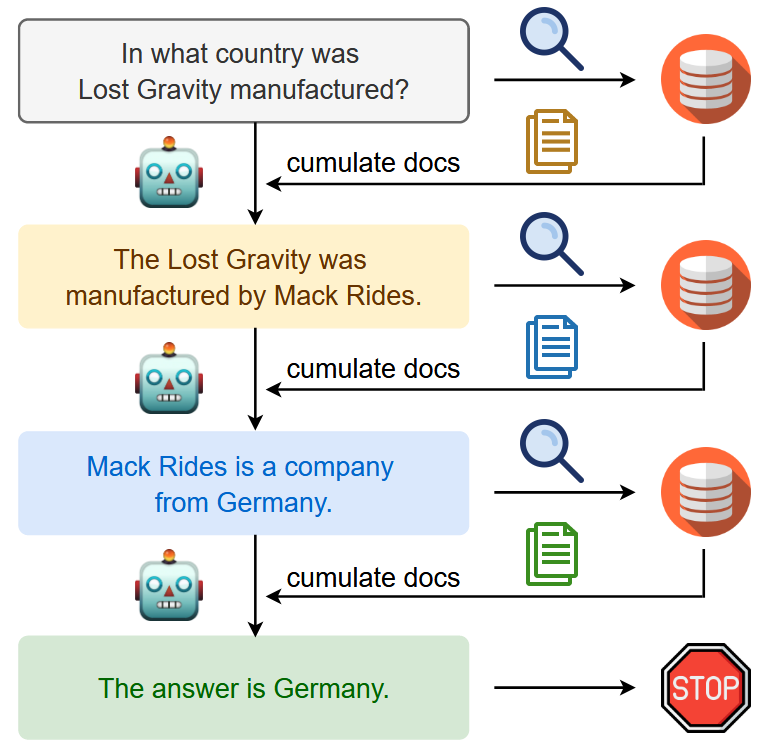

# The Reproduction of IRCoT
This is the reproduction of the paper ["Interleaving Retrieval with Chain-of-Thought Reasoning for Knowledge-Intensive Multi-Step Questions"](https://aclanthology.org/2023.acl-long.557/).

## Introduction
IRCoT interleaves chain-of-thought (CoT) generation and knowledge retrieval steps in order to guide the retrieval by CoT and vice-versa.
<center>

</center>

## Running the Method
Before conducting the experiment, you need to prepare the generator. In this example, we use VLLM to deploy the generator, you can skip this step if you wish to use the generator from OpenAI.
```bash
bash ./run_generator.sh
```
This script will start a `Qwen2-7B-Instruct` model server on port 8000. You can change the `MODEL_NAME` in the script if you want to use a different model.


Then, run the following command to evaluate the IRCoT on the test set of `Natural Questions`:
```bash
bash ./run.sh
```
This script will run the IRCoT method on the test set of `Natural Questions` and save the results in the `results` directory. You can change the `DATASET_NAME` and the `SPLIT` variables in the script to evaluate on different datasets.

## Experiments

### Experiment Settings
- **Model**: We use the `Qwen2-7B-Instruct` model.
- **Retriever**: We use `FlexRAG/wiki2021_atlas_contriever` retriever.
- **max_iterations**: We set the maximum number of iterations to 5.
- **top_k**: We set the number of top-k retrieved documents to 5.
- **temperature**: We set the generation temperature to 0 for deterministic generation.

### Experimental Results
TODO


## Citation
If you use this code in your research, please cite the following paper:

```bibtex
@software{Zhang_FlexRAG_2025,
author = {Zhang, Zhuocheng and Feng, Yang and Zhang, Min},
doi = {10.5281/zenodo.14593327},
month = jan,
title = {{FlexRAG}},
url = {https://github.com/ictnlp/FlexRAG},
year = {2025}
}
```

```bibtex
@inproceedings{trivedi-etal-2023-interleaving,
    title = "Interleaving Retrieval with Chain-of-Thought Reasoning for Knowledge-Intensive Multi-Step Questions",
    author = "Trivedi, Harsh  and
      Balasubramanian, Niranjan  and
      Khot, Tushar  and
      Sabharwal, Ashish",
    editor = "Rogers, Anna  and
      Boyd-Graber, Jordan  and
      Okazaki, Naoaki",
    booktitle = "Proceedings of the 61st Annual Meeting of the Association for Computational Linguistics (Volume 1: Long Papers)",
    month = jul,
    year = "2023",
    address = "Toronto, Canada",
    publisher = "Association for Computational Linguistics",
    url = "https://aclanthology.org/2023.acl-long.557/",
    doi = "10.18653/v1/2023.acl-long.557",
    pages = "10014--10037",
    abstract = "Prompting-based large language models (LLMs) are surprisingly powerful at generating natural language reasoning steps or Chains-of-Thoughts (CoT) for multi-step question answering (QA). They struggle, however, when the necessary knowledge is either unavailable to the LLM or not up-to-date within its parameters. While using the question to retrieve relevant text from an external knowledge source helps LLMs, we observe that this one-step retrieve-and-read approach is insufficient for multi-step QA. Here, \textit{what to retrieve} depends on \textit{what has already been derived}, which in turn may depend on \textit{what was previously retrieved}. To address this, we propose IRCoT, a new approach for multi-step QA that interleaves retrieval with steps (sentences) in a CoT, guiding the retrieval with CoT and in turn using retrieved results to improve CoT. Using IRCoT with GPT3 substantially improves retrieval (up to 21 points) as well as downstream QA (up to 15 points) on four datasets: HotpotQA, 2WikiMultihopQA, MuSiQue, and IIRC. We observe similar substantial gains in out-of-distribution (OOD) settings as well as with much smaller models such as Flan-T5-large without additional training. IRCoT reduces model hallucination, resulting in factually more accurate CoT reasoning."
}
```