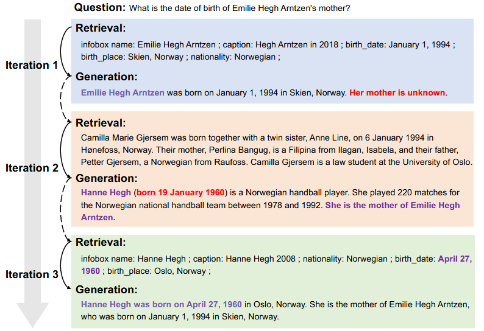

# ITRG / Iter-RetGen
This is the reproduction of the paper:
- [Enhancing Retrieval-Augmented Large Language Models with Iterative  Retrieval-Generation Synergy](https://aclanthology.org/2023.findings-emnlp.620/)
- [Retrieval-Generation Synergy Augmented Large Language Models](https://ieeexplore.ieee.org/stamp/stamp.jsp?arnumber=10448015)


## Introduction
ITRG & ITER-RETGEN iterate retrieval and generation. In each iteration, they leverages the model output from the previous iteration as a specific context to help retrieve more relevant knowledge, which may help improve model generation.

<center>

</center>

## Running the Method
Before conducting the experiment, you need to prepare the generator. In this example, we use VLLM to deploy the generator, you can skip this step if you wish to use the generator from OpenAI.
```bash
bash ./run_generator.sh
```
This script will start a `Qwen2-7B-Instruct` model server on port 8000. You can change the `MODEL_NAME` in the script if you want to use a different model.


Then, run the following command to evaluate the ITRG on the test set of `Natural Questions`:
```bash
bash ./run.sh
```
This script will run the ITRG method on the test set of `Natural Questions` and save the results in the `results` directory. You can change the `DATASET_NAME` and the `SPLIT` variables in the script to evaluate on different datasets.

## Experiments

### Experiment Settings
- **Model**: We use the `Qwen2-7B-Instruct` model.
- **Retriever**: We use `FlexRAG/wiki2021_atlas_contriever` retriever.
- **max_iterations**: We set the maximum number of iterations to 2.
- **top_k**: We set the number of top-k retrieved documents to 5.
- **temperature**: We set the generation temperature to 0 for deterministic generation.

### Experimental Results
TODO


## Citation
If you use this code in your research, please cite the following paper:

```bibtex
@software{Zhang_FlexRAG_2025,
author = {Zhang, Zhuocheng and Feng, Yang and Zhang, Min},
doi = {10.5281/zenodo.14593327},
month = jan,
title = {{FlexRAG}},
url = {https://github.com/ictnlp/FlexRAG},
year = {2025}
}
```

```bibtex
@inproceedings{shao-etal-2023-enhancing,
    title = "Enhancing Retrieval-Augmented Large Language Models with Iterative Retrieval-Generation Synergy",
    author = "Shao, Zhihong  and
      Gong, Yeyun  and
      Shen, Yelong  and
      Huang, Minlie  and
      Duan, Nan  and
      Chen, Weizhu",
    editor = "Bouamor, Houda  and
      Pino, Juan  and
      Bali, Kalika",
    booktitle = "Findings of the Association for Computational Linguistics: EMNLP 2023",
    month = dec,
    year = "2023",
    address = "Singapore",
    publisher = "Association for Computational Linguistics",
    url = "https://aclanthology.org/2023.findings-emnlp.620/",
    doi = "10.18653/v1/2023.findings-emnlp.620",
    pages = "9248--9274",
    abstract = "Retrieval-augmented generation has raise extensive attention as it is promising to address the limitations of large language models including outdated knowledge and hallucinations. However, retrievers struggle to capture relevance, especially for queries with complex information needs. Recent work has proposed to improve relevance modeling by having large language models actively involved in retrieval, i.e., to guide retrieval with generation. In this paper, we show that strong performance can be achieved by a method we call Iter-RetGen, which synergizes retrieval and generation in an iterative manner: a model`s response to a task input shows what might be needed to finish the task, and thus can serve as an informative context for retrieving more relevant knowledge which in turn helps generate a better response in another iteration. Compared with recent work which interleaves retrieval with generation when completing a single output, Iter-RetGen processes all retrieved knowledge as a whole and largely preserves the flexibility in generation without structural constraints. We evaluate Iter-RetGen on multi-hop question answering, fact verification, and commonsense reasoning, and show that it can flexibly leverage parametric knowledge and non-parametric knowledge, and is superior to or competitive with state-of-the-art retrieval-augmented baselines while causing fewer overheads of retrieval and generation. We can further improve performance via generation-augmented retrieval adaptation."
}
```

```bibtex
@INPROCEEDINGS{10448015,
  author={Feng, Zhangyin and Feng, Xiaocheng and Zhao, Dezhi and Yang, Maojin and Qin, Bing},
  booktitle={ICASSP 2024 - 2024 IEEE International Conference on Acoustics, Speech and Signal Processing (ICASSP)}, 
  title={Retrieval-Generation Synergy Augmented Large Language Models}, 
  year={2024},
  volume={},
  number={},
  pages={11661-11665},
  keywords={Knowledge based systems;Collaboration;Signal processing;Cognition;Question answering (information retrieval);Acoustics;Iterative methods;large language models;retrieval augmented;question answering},
  doi={10.1109/ICASSP48485.2024.10448015}
}
```