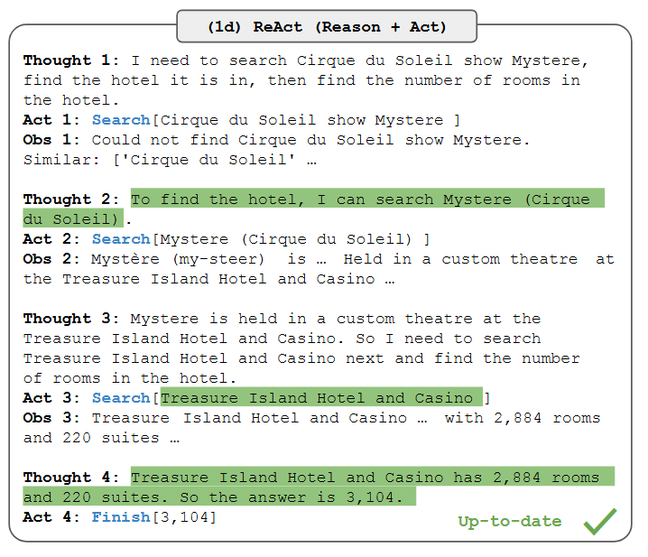

# ITRG / Iter-RetGen
This is the reproduction of the paper:
- [ReAct: Synergizing Reasoning and Acting in Language Models](https://par.nsf.gov/biblio/10451467)


## Introduction
ReAct solves knowledge-intensive tasks by taking both reasoning and retrieving actions in an interleaved manner, allowing for greater synergy between the two: reasoning traces help the model induce, track, and update action plans as well as handle exceptions, while actions allow it to interface with and gather additional information from external sources such as knowledge bases or environments.

<center>

</center>

## Running the Method
Before conducting the experiment, you need to prepare the generator. In this example, we use VLLM to deploy the generator, you can skip this step if you wish to use the generator from OpenAI.
```bash
bash ./run_generator.sh
```
This script will start a `Qwen2-7B-Instruct` model server on port 8000. You can change the `MODEL_NAME` in the script if you want to use a different model.


Then, run the following command to evaluate the ReACT on the test set of `Natural Questions`:
```bash
bash ./run.sh
```
This script will run the ReACT method on the test set of `Natural Questions` and save the results in the `results` directory. You can change the `DATASET_NAME` and the `SPLIT` variables in the script to evaluate on different datasets.

## Citation
If you use this code in your research, please cite the following paper:

```bibtex
@software{Zhang_FlexRAG_2025,
author = {Zhang, Zhuocheng and Feng, Yang and Zhang, Min},
doi = {10.5281/zenodo.14593327},
month = jan,
title = {{FlexRAG}},
url = {https://github.com/ictnlp/FlexRAG},
year = {2025}
}
```

```bibtex
@inproceedings{yao2023react,
  title={React: Synergizing reasoning and acting in language models},
  author={Yao, Shunyu and Zhao, Jeffrey and Yu, Dian and Du, Nan and Shafran, Izhak and Narasimhan, Karthik and Cao, Yuan},
  booktitle={International Conference on Learning Representations (ICLR)},
  year={2023}
}
```
